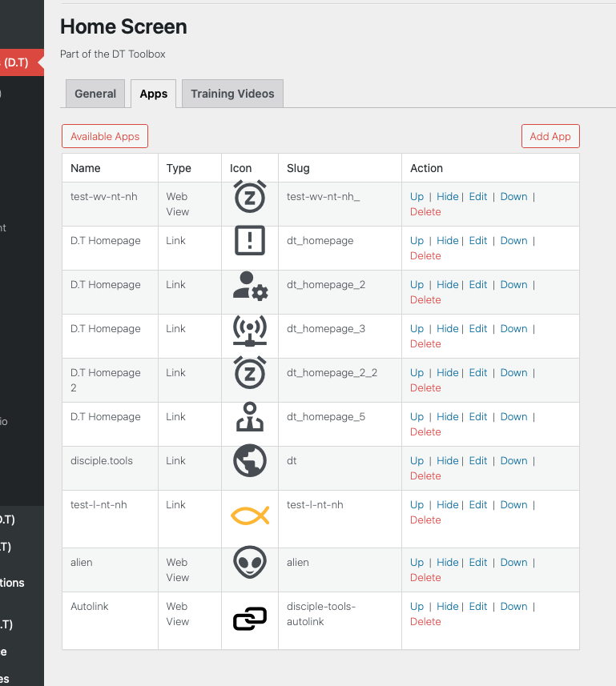
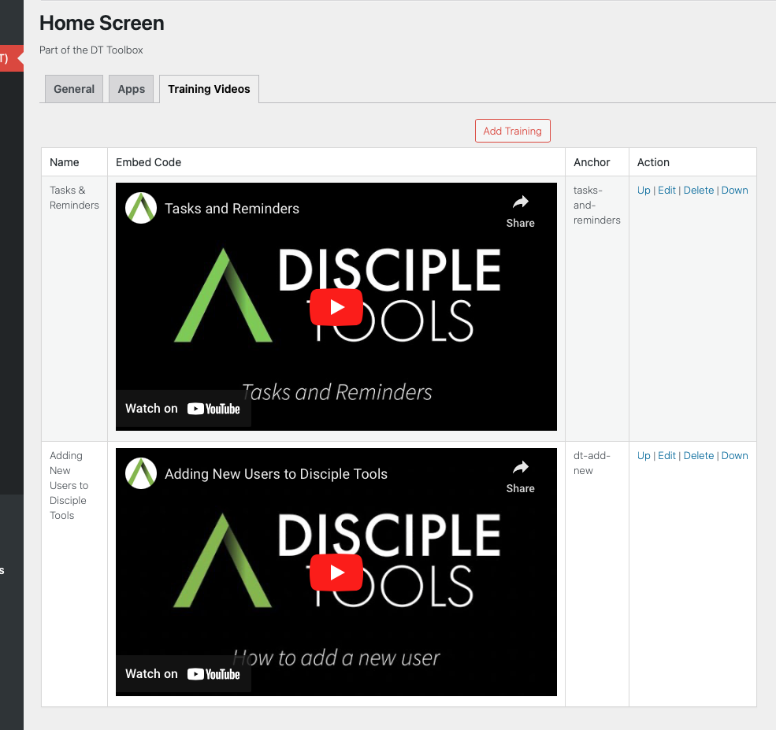
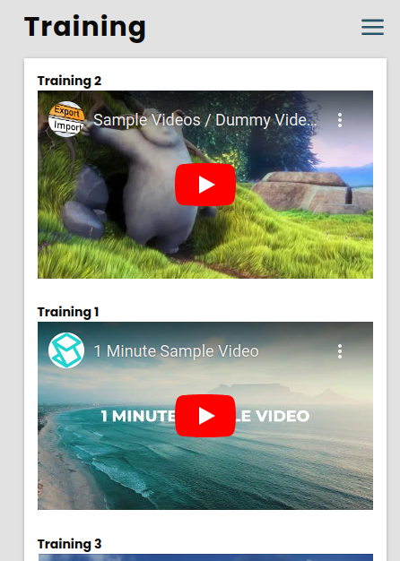

# Disciple.Tools - Home Screen

A centrally organised space, to streamline the faith journey.

## Purpose

The Home Screen plugin provides a simple way of storing custom apps and training videos, within a centrally organised space; with the aim of streamlining a user's faith journey.

Follow the links below for detailed descriptions of the functionality offered by the Home Screen Plugin:

- [Plugin Setup & Management](./documentation/admin/README.md)
- [Home Screen Custom Apps](./documentation/apps/README.md)
- [Home Screen Training Videos](./documentation/train/README.md)

## Requirements

- Disciple.Tools Theme installed on a Wordpress Server

## Installing

- Install as a standard Disciple.Tools/Wordpress plugin in the system Admin/Plugins area.
- Requires the user role of Administrator.

## Framework

See [dt-plugin](https://github.com/thecodezone/dt-plugin) documentation, for a detailed description of the implemented Laravel framework; which the Disciple.Tools Home Screen plugin has been built upon.

## Contribution

Contributions welcome. You can report issues and bugs in the
[Issues](https://github.com/thecodezone/dt-home/issues) section of the repo. You can
present ideas
in the [Discussions](https://github.com/thecodezone/dt-home/discussions) section of the
repo. And
code contributions are welcome using
the [Pull Request](https://github.com/thecodezone/dt-home/pulls)
system for git. For a more details on contribution see the
[contribution guidelines](https://github.com/thecodezone/dt-home/blob/master/CONTRIBUTING.md).

## Screenshots

