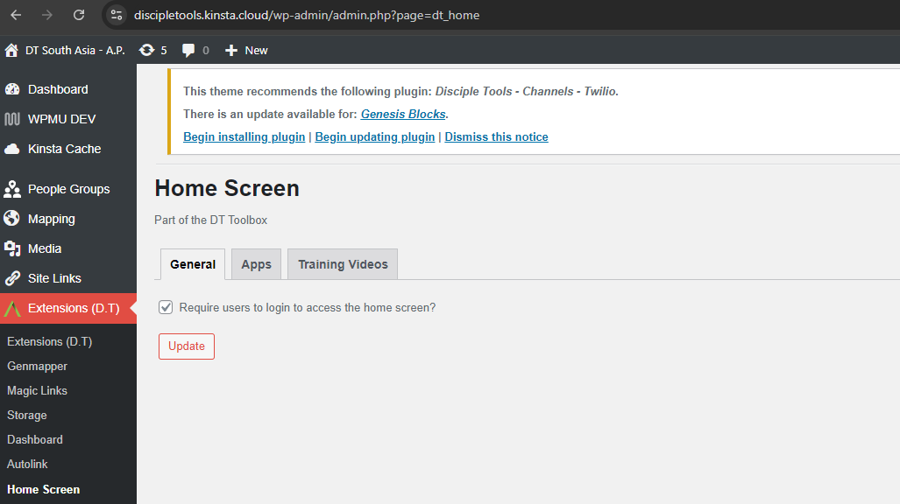

# Administration

The Home Screen plugin, is currently configured via the admin view and in addition to user access
management, it also enables Administrators to setup both Custom Apps and Training Videos.

A detailed description of available functionality, is provided below.

## General Tab

Administrators can currently specify if users should be challenged whilst attempting to access their Home Screen. This is especially helpful
for non-logged in users, wanting to gain direct access.

Simply Un/Select checkbox; Save and refresh Home Screen; for functionality to take effect.

## Apps Tab

The main Apps Tab view, presents a complete list of installed apps; in addition to actions to create, update, remove and adjust app Home Screen ordering.

See links below, for further descriptions of available actions.

- [Add Apps To Home Screen](./apps/create.md)
- [Update Existing Apps](./apps/update.md)
- [Delete Existing Apps](./apps/delete.md)
- [Reorder Existing Apps](./apps/reorder.md)

## Training Videos Tab

Similar to the Apps Tab, the Training Videos Tab, also presents a complete list of embedded videos and accompanying management actions, as described below.

- [Add Training Videos To Home Screen](./train/create.md)
- [Update Existing Training Videos](./train/update.md)
- [Delete Existing Training Videos](./train/delete.md)
- [Reorder Existing Training Videos](./train/reorder.md)
