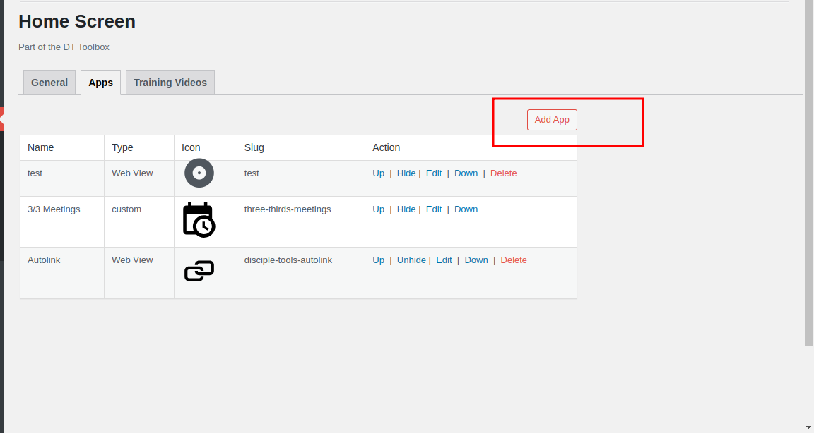
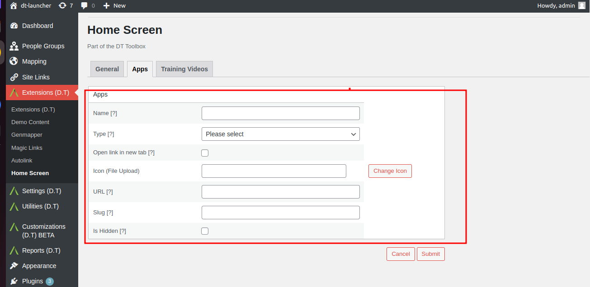
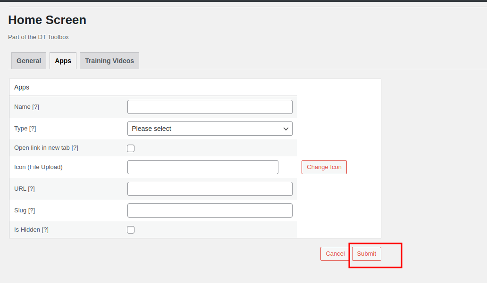
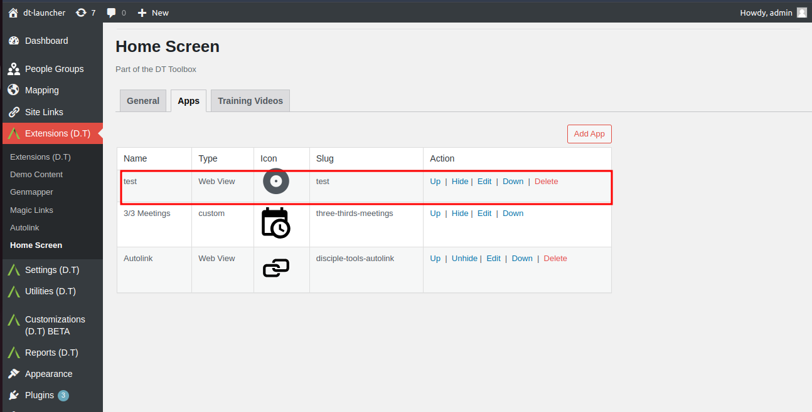

# Add Apps To Home Screen

Click the Add App button located within the top right-hand corner.

Within the presented Apps view, enter valid information for the following fields:
- Name: A unique app name.
- Type: Web View or Link.
- Open link in new tab: Y/N
- Icon
- URL: Valid URL to target app.
- Slug: Unique slug name to be assigned to app; which is auto-generated, based on above Name.
- Is Hidden: Leave unchecked.

Click on the Submit button to confirm and save entered information.

Return to the Apps Tab and confirm newly added app has been created and is listed accordingly.

