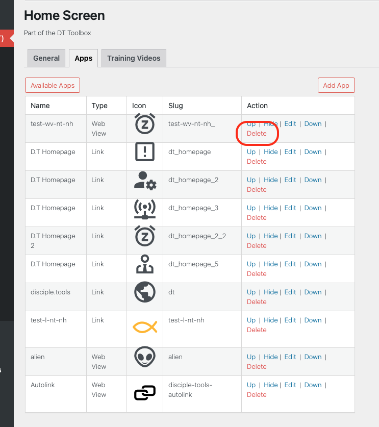
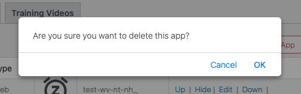

# Delete Existing Apps

Locate the app to be removed and click on the Delete option.

When prompted, confirm you are happy with the removal of app from the Home Screen.

Following a page refresh, confirm the deleted app has been successfully removed for the Apps Tab list.
