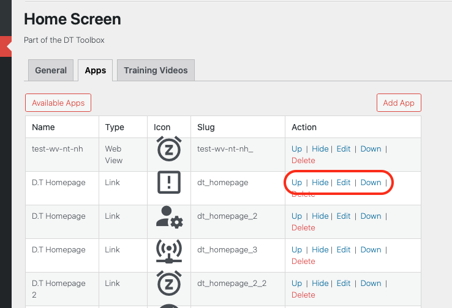

# Reorder Existing Apps

From the Apps Tab list view, you will notice a number of options relating to the ordering and positioning of apps within the Home Screen.

Depending on your requirements, an apps position can be updated accordingly, by clicking on any of the following options:

- Up: Move app position up a step.
- Down: Move app position down a step.
- Hide: Hide app from main Home Screen view.
- Unhide: Re-display hidden app within main Home Screen view.
