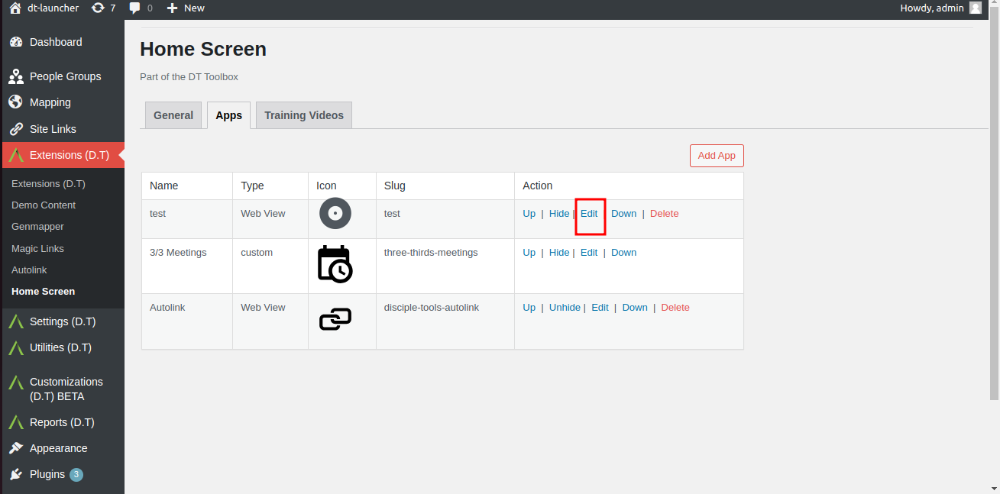
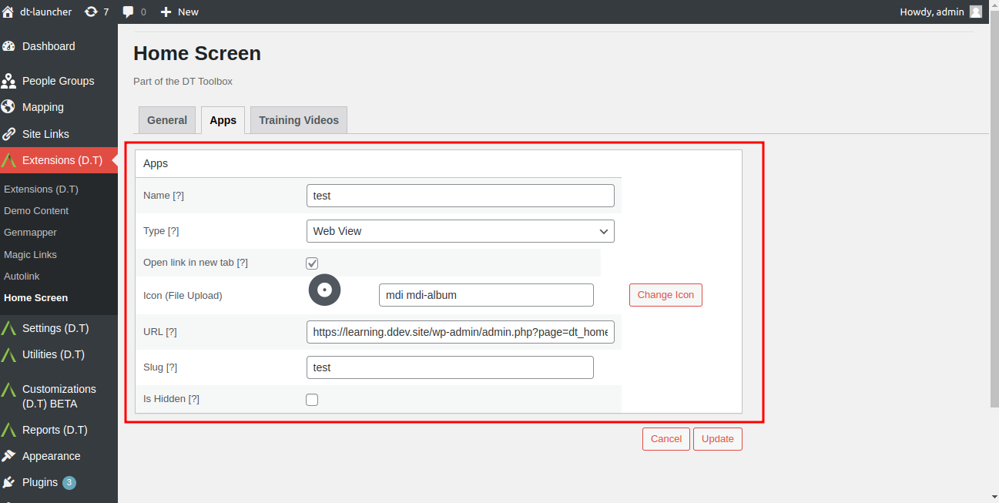
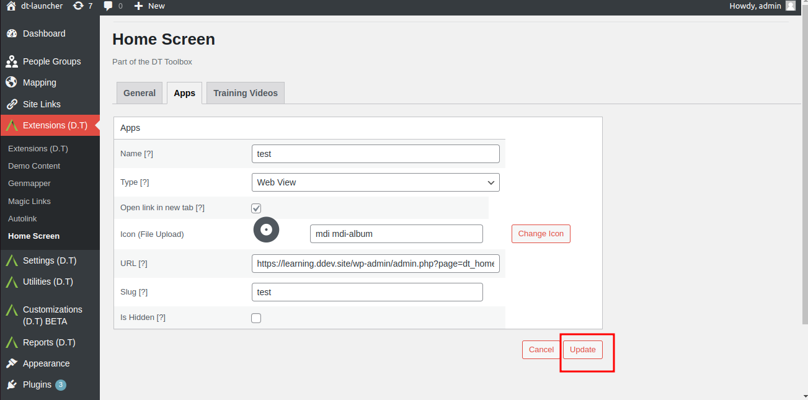
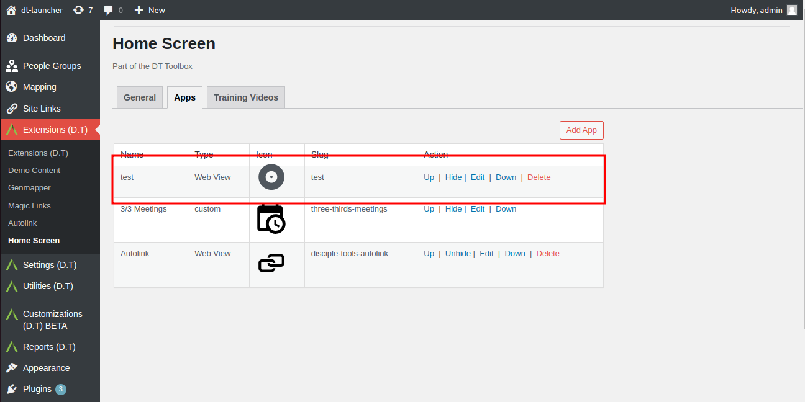

# Update Existing Apps

Locate a recently added app and click on the Edit option.

Update the following fields with valid data:
- Name: Update app name.
- Type: Toggle between options.
- Open link in new tab: Toggle between options.
- Icon: Update icon image.
- URL: Update URL.
- Is Hidden: Leave unchecked.

Click on the Update button to save changes.

Ensure the data you entered appears correctly, by returning to the admin apps tab and confirming updates are shown.

