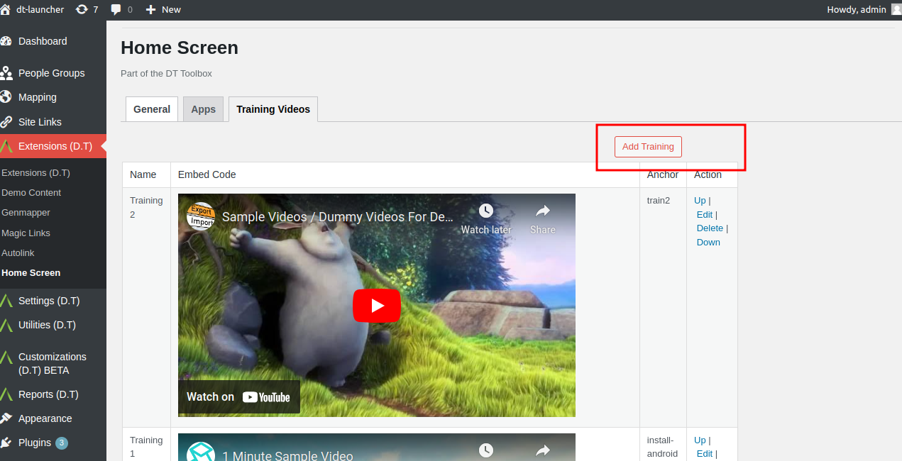
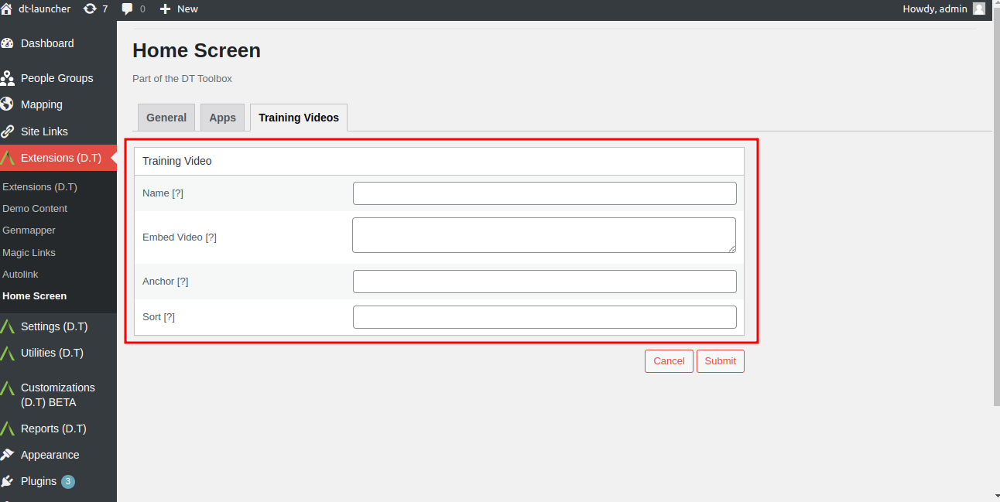
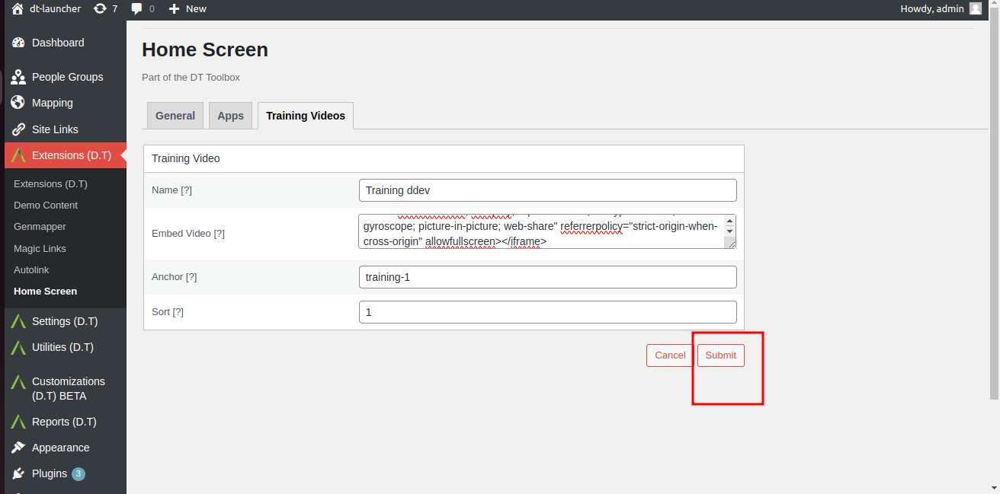
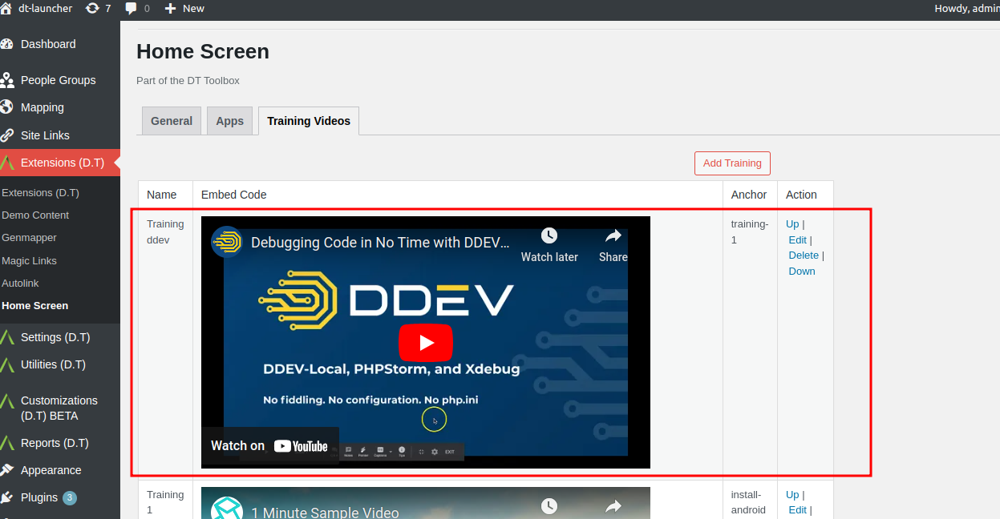

# Add Training Videos To Home Screen

Click on the Add Training button in the top right-hand corner.

Within the presented Training Videos view, enter valid information for the following fields:
- Name: A unique name.
- Embed Video: Embedded Video Link HTML.
- Anchor:
- Sort:

Click on the Submit button to save new video details.

Return to admin Training Videos tab and confirm newly added video is displayed.

