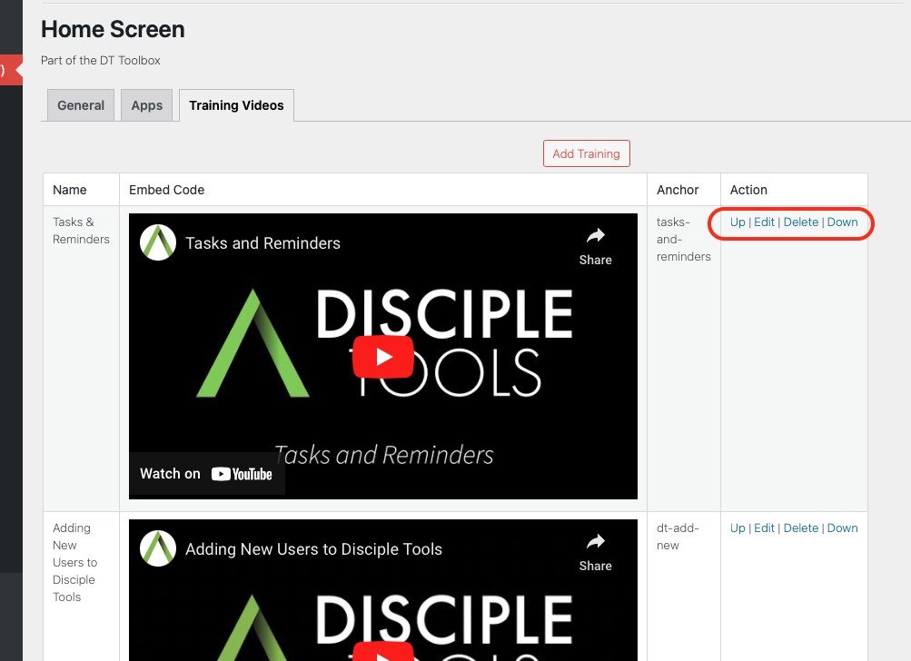

# Reorder Existing Training Videos

From the Training Video Tab list view, you will notice a number of options relating to the ordering of videos within the Home Screen.

Depending on your requirements, an apps position can be updated accordingly, by clicking on any of the following options:

- Up: Move video position up a step.
- Down: Move video position down a step.
