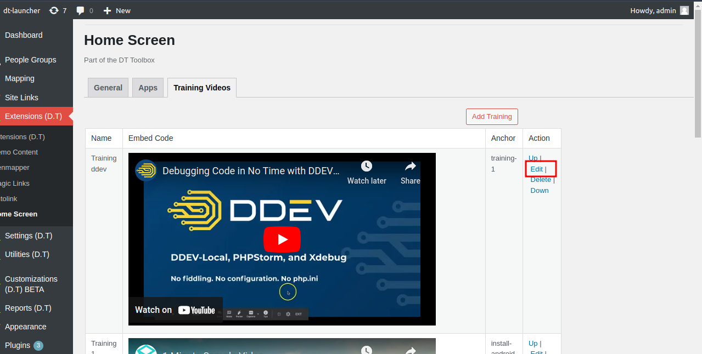
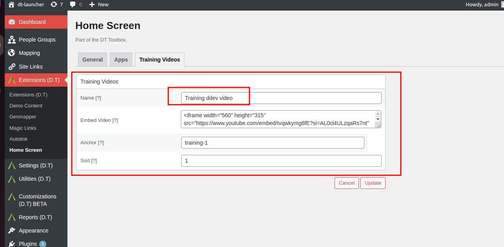
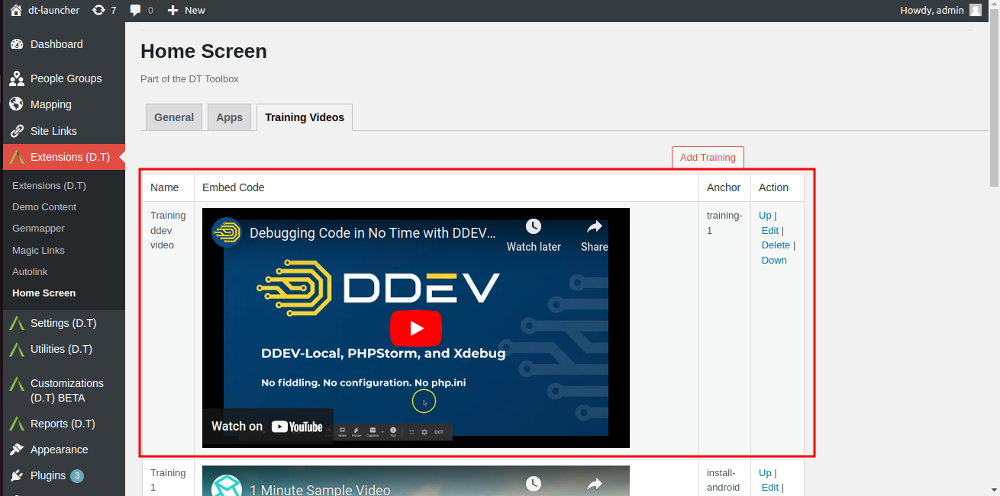

# Update Existing Training Videos

Locate a recently added video and click on the Edit option.

Update anyone of the following fields with valid data:
- Name: A unique name.
- Embed Video: Video Link.
- Anchor:
- Sort:

Click on the Update button to save changes.

Return to admin Training Videos tab and confirm updates are shown.

