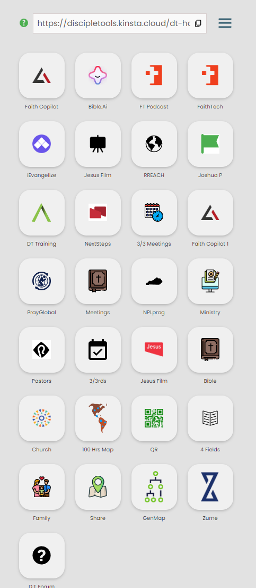

# Home Screen Custom Apps

Once apps have been successfully added and setup, they can be accessed via the frontend Home Screen display.

The following sections describe the typical steps involved, when using custom apps.

## Home Screen URLs

The Home Screen URLs used to access the frontend, are typically copied from the D.T user settings section, as shown below.

## User Login

Users may be challenged for login credentials, whilst navigating to the copied Home screen URL. This will be most likely if the login prompt has been enabled by the administrator.

If prompted, enter user credentials and proceed to Home Screen. A new user account can also be registered if required.

## Home Screen

Once successfully validated, users will be directed to the Home Screen, from where they shall be able to access all installed apps, by simply clicking on the corresponding app icon.

