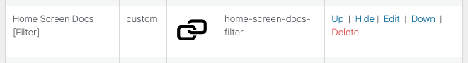
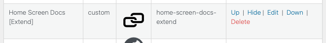

# Registering New Custom Apps

The Home Screen Plugin, also supports developers wanting to extend functionality, with the use of new custom apps.

The following sections outline the two main methods currently available to developers wanting to make use of this functionality.

## Method 1: PHP Filter

In order to use this method, add a new filter for the hook `dt_home_apps`; as shown in the following sample code.

```php
add_filter( 'dt_home_apps', function( $apps ) {

    /**
     * Step 1:
     *  - Build array containing custom app config values.
     */

    $custom_app_config = [
        "name" => "Home Screen Docs [Filter]",
        "type" => "Link",
        'creation_type' => 'code',
        "icon" => "/wp-content/themes/disciple-tools-theme/dt-assets/images/link.svg",
        'url' => 'https://disciple.tools',
        "sort" => 0,
        "slug" => "home-screen-docs-filter",
        "is_hidden" => false,
        'open_in_new_tab' => true
    ];

    /**
     * Step 2:
     *  - Always ensure to check if proposed slug already exists.
     *  - Only append custom app config array, if slug has not already been used.
     */

    $dup_apps_by_slug = array_filter( $apps, function ( $app ) use ( $custom_app_config ) {
        return ( isset( $app['slug'] ) && ( $app['slug'] === $custom_app_config['slug'] ) );
    } );

    /**
     * Step 3:
     *  - Only append custom app, if slug has not already been used.
     */

    if ( count( $dup_apps_by_slug ) === 0 ) {
        $apps[] = $custom_app_config;
    }

    return $apps;
} );
```
- Custom App Configuration Values:
  - __name__
    - A unique name to be used as custom app label.
  - __type__
    - Set to any of the following types:
      - Link: Direct URL based apps.
      - Web View: Magic Link based apps.
  - __creation_type__
    - Set to `code`, to ensure app is processed accordingly as a code-based app.
  - __icon__
    - Relative uri or mdi font-icon value.
  - __url__
    - URL to be assigned to app.
  - __sort__
    - Sort order to be assigned to app.
  - __slug__
    - A unique slug id to be assigned to app.
  - __is_hidden__
    - Boolean value to determine if app should be hidden or displayed.
  - __open_in_new_tab__
    - Boolean value to determine if app should be displayed in situ or within a new tab.

Assuming the filter successfully registers the new custom app; with a unique slug; you should then see the app listed within the Admin Apps Tab.



## Method 2: Extending DT\Home\Apps\App

Another alternative approach to registering custom apps, is to extend the `DT\Home\Apps\App` class, as shown in the following sample code below.

```php
namespace DT\Home\Apps;

use function DT\Home\is_plugin_active;

class HomeScreenDocs extends App
{

    public function config(): array
    {
        /**
         * Step 1:
         *  - Build array containing custom app config values.
         */

        return [
            "name" => "Home Screen Docs [Extend]",
            "type" => "Web View",
            'creation_type' => 'code',
            "icon" => "/wp-content/themes/disciple-tools-theme/dt-assets/images/link.svg",
            'url' => '/docs',
            "sort" => 0,
            "slug" => "home-screen-docs-extend",
            "is_hidden" => false,
            'open_in_new_tab' => true
        ];
    }

    public function authorized(): bool
    {
        /**
         * Step 2:
         *  - Implement authorization logic; in the case of this example, we check for the existence of corresponding plugin.
         */

        if ( !is_plugin_active( 'disciple-tools-home-screen-docs/disciple-tools-home-screen-docs.php' ) ) {
            return false;
        }

        return true;
    }
}
```
To activate the new custom app, you can simply instantiate a new object; which would automatically register the instantiated instance with the filter.

Alternatively, it can be listed within the `DT\Home\Providers\AppServiceProvider` app array; as shown below.

```php
namespace DT\Home\Providers;

use DT\Home\Apps\Autolink;
use DT\Home\Apps\BiblePlugin;
use DT\Home\Apps\ThreeThirdsMeetings;
use DT\Home\Apps\HomeScreenDocs; //*** New Custom App ***//

class AppServiceProvider extends ServiceProvider {
    protected $apps = [
        Autolink::class,
        BiblePlugin::class,
        ThreeThirdsMeetings::class,
        HomeScreenDocs::class //*** New Custom App ***//
    ];

    public function register(): void {
    }

    public function boot(): void {
        foreach ( $this->apps as $app ) {
            $this->container->make( $app );
        }
    }
}
```

Again, once the new custom app has been successfully registered, it will be shown within the Admin Apps Tab.


