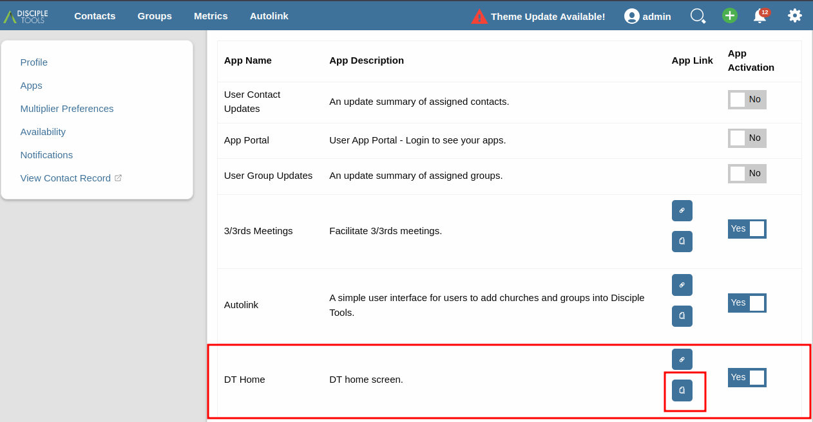
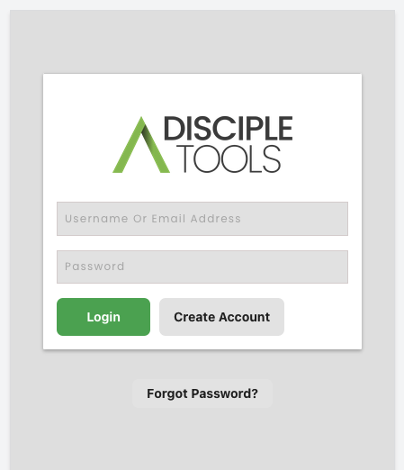
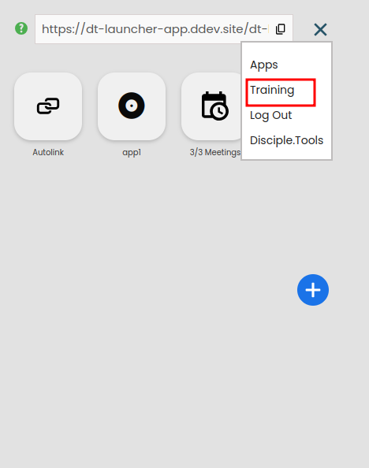

# Home Screen Training Videos

Once training videos have been successfully added and setup, they can be accessed via the frontend Home Screen display.

The following sections describe the typical steps involved, whilst accessing embedded videos.

## Home Screen URLs

The Home Screen URLs used to access the frontend, are typically copied from the D.T user settings section, as shown below.

## User Login

Users may be challenged for login credentials, whilst navigating to the copied Home screen URL. This will be most likely if the login prompt has been enabled by the administrator.

If prompted, enter user credentials and proceed to Home Screen. A new user account can also be registered if required.

## Home Screen Menu

Following a successful login, user will be directed to their Home Screen. From there, access to the Training Videos can be obtained via the menu option, as shown below.

## Training View

Users will then be directed to the Training view, where installed embedded videos can be watched.

